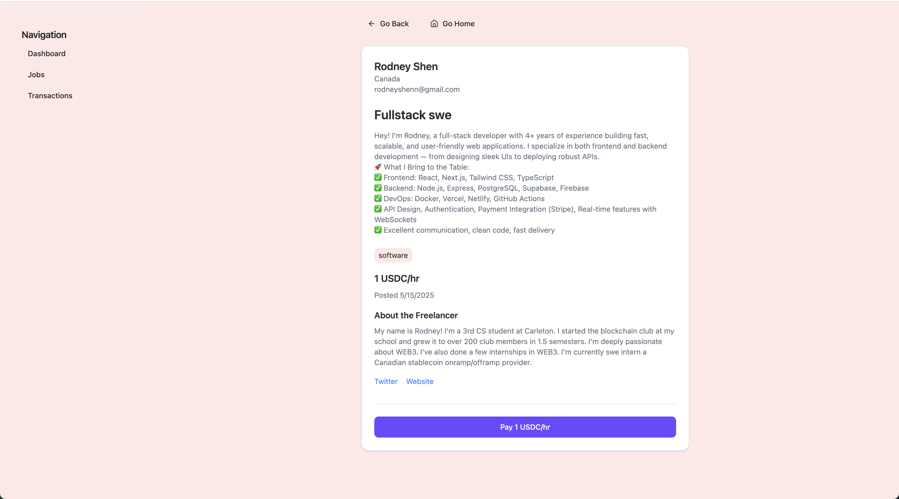
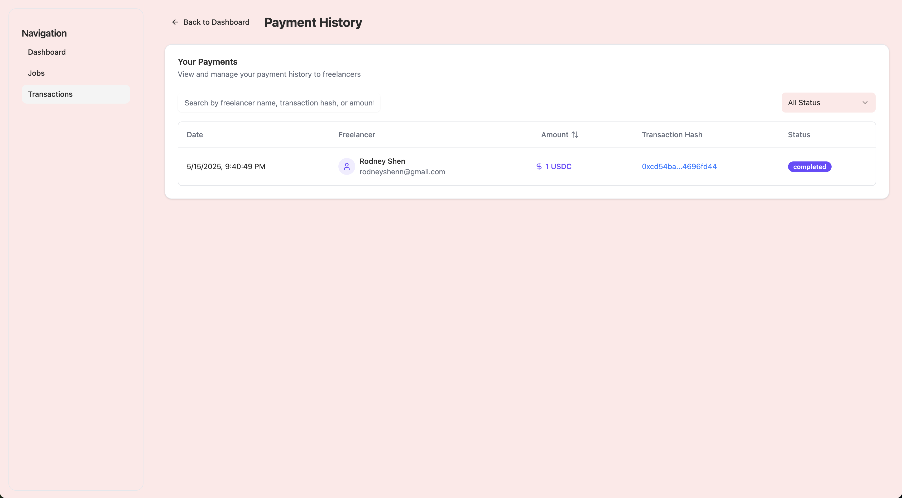
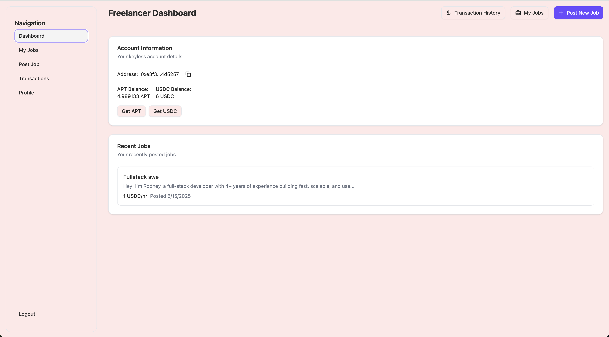
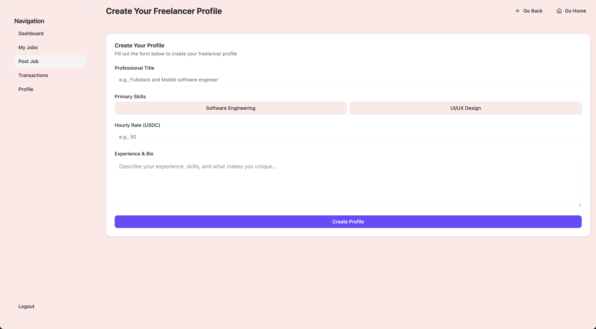
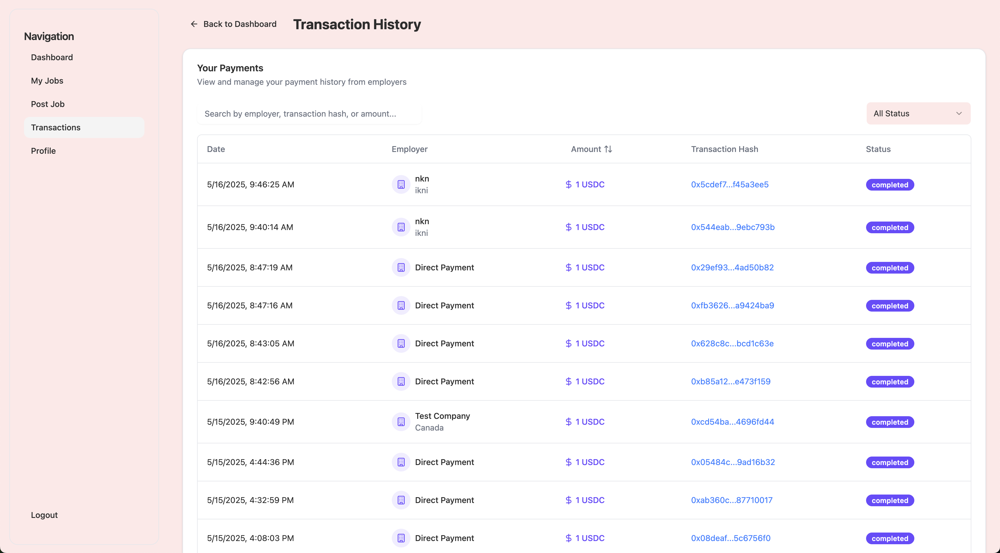
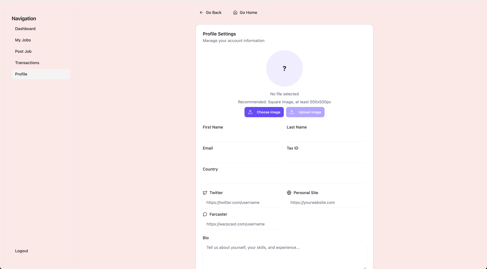

# Giggle - Stablecoin based freelancing platform

## Demo videos

[](https://www.loom.com/share/c81784967af5450ab15c391abe631c3a)
[](https://www.loom.com/share/035e41fbd52e47f58d0cc6788ff44b2d)

A modern web application that connects freelancers with employers, built with Next.js, React, Supabase, and Aptos TS SDK for chain actions.

## What We Do

### For Freelancers
- Create and manage your professional profile
- Track your cryptocurrency earnings (APT and USDC)
- Browse and apply for job listings
- View your transaction history

### For Employers
- Post and manage job listings
- Review freelancer profiles
- Handle payments and payouts
- Track active jobs

## Tech Stack
- Next.js & React
- TypeScript
- Aptos Blockchain Integration

## Quick Start
```bash
# Install dependencies
npm install

# Start development server
npm run dev
```

## Features
- Professional profile management
- Real-time cryptocurrency balance tracking
- Job listing marketplace
- Secure payment system
- Modern, responsive design

## Project Structure
- `/src/app` - Main application pages
- `/components` - Reusable UI components
- `/public` - Static assets and images


## Screenshots(Employer POV)

### Employer Dashboard Page


### Employer Jobs


### Employer Payouts


## Screenshots(Freelancer POV)

### Freelancer Dashboard Page


### Freelancer Post Page


### Freelancer Transactions Page


### Freelancer Profile Page

