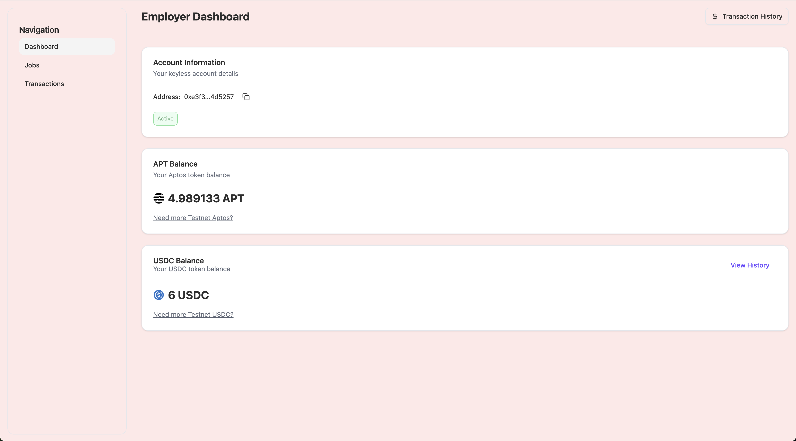

# Freelancer Dashboard

A modern web application for freelancers to manage their profile, view balances, and handle job listings. Built with Next.js and React.

## Features



### 1. Profile Management
- Professional profile display with:
  - Profile image
  - Name display
  - Bio section
  - Social media links (Twitter, Website, Farcaster)
- Edit profile functionality

### 2. Balance Tracking
- Real-time display of cryptocurrency balances:
  - APT (Aptos) balance
  - USDC balance
- Visual representation with token icons

### 3. Job Listings
- Active listings management
- Post new job listings
- View current job listings with:
  - Title
  - Description
  - Budget
  - Status

## Technical Stack

- **Framework**: Next.js
- **Language**: TypeScript
- **UI Components**: Custom UI components using a component library
- **Authentication**: Keyless account system
- **State Management**: React hooks (useState)
- **Routing**: Next.js navigation

## Key Components

### Profile Section
- Displays user information
- Social media integration
- Profile image handling with fallback to initials
- Edit profile button

### Balance Section
- Grid layout for different token balances
- Visual representation of APT and USDC balances
- Token icons integration

### Listings Section
- Active listings display
- New listing creation functionality
- Job posting management

## Getting Started

1. Clone the repository
2. Install dependencies:
   ```bash
   npm install
   ```
3. Run the development server:
   ```bash
   npm run dev
   ```

## Dependencies

- Next.js
- React
- Lucide React (for icons)
- Custom UI components
- Image handling with Next.js Image component
- Aptos TS SDK

## Project Structure

The application follows a component-based architecture with:
- Pages in the `src/app` directory
- Components in the `components` directory
- Context providers for authentication
- Custom hooks for account management